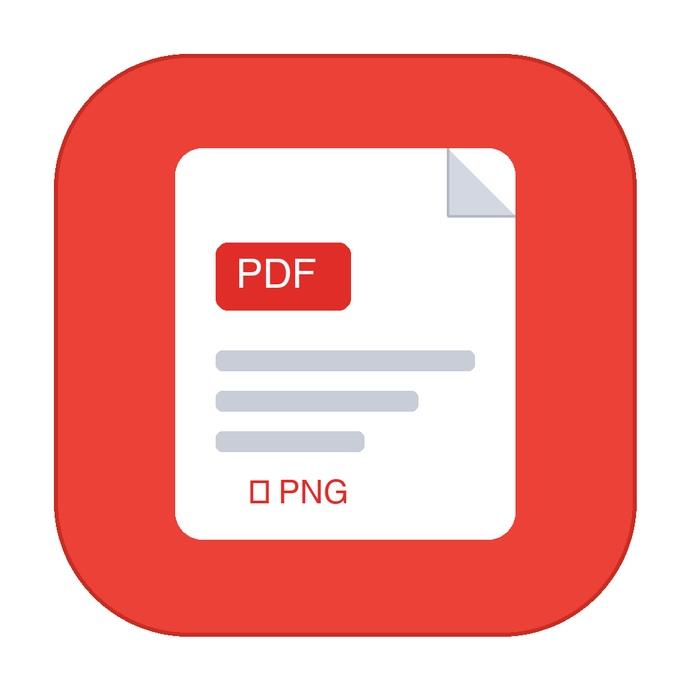

# PDF to Images

<p align="center">
  
</p>

<p align="center">
  <strong>Drop a PDF. Get images in milliseconds. Continue with your life.</strong>
</p>

<p align="center">
  <a href="https://pdftoimages.vercel.app/">Live website preview ↗</a>
</p>

---

## Get it

### One command (recommended):

```bash
brew install --cask yourarnav/tap/pdftoimages
```

*(Homebrew automatically resolves and installs Poppler in the background if you don't already have it.)*

### Manual DMG:

Prefer the manual route? Download `PDFtoImages.dmg` from [Releases](https://github.com/yourarnav/PDFtoImages/releases), open it, and drag **PDF to Images** into `/Applications`.

First launch: your Mac may report that the app is damaged because it is free, open source, and self-signed (not Apple-notarized with a $99/year developer fee). Clear the quarantine flag once, then open it normally:

```bash
xattr -dr com.apple.quarantine "/Applications/PDF to Images.app"
```

That single command is the price of free.

---

## Why not a web converter?

You shouldn't have to upload your tax filings, employment contracts, medical records, or pitch decks to an ad-riddled cloud server just to turn a 3-page PDF into images.

**PDF to Images is 100% offline and local.**
- Zero network requests. Zero tracking.
- No file upload queues, no 25 MB file size caps, and no email signups.
- Convert a 500-page document or 50 PDFs in one drag.

---

## It does one job

1. Drag any PDF document into the app window (or drop it directly onto the app's Dock icon).
2. Choose your DPI (**150 DPI** screen, **300 DPI** print, or **600 DPI** ultra-high resolution).
3. A clean folder containing `page_1.png`, `page_2.png`, `page_3.png` appears instantly on your Desktop under `Desktop/images/[Document]_pages`.

When you close the window, the app terminates immediately. No background daemons reconsidering their purpose six hours after you stopped converting.

---

## Built like a genuine Mac app

- **Native Cocoa + AppKit**: Hand-crafted Objective-C compiled directly with Clang `-O3`.
- **Ultra-lean**: **100 KB** binary size (entire DMG download is only **155 KB**).
- **Universal 2**: Runs natively on both Apple Silicon (`arm64`) and Intel (`x86_64`) Macs (macOS 12 Monterey or later).
- **Zero Electron**: No hidden Chromium instance eating 600 MB of RAM. No web view wearing a `.app` costume.
- **Process execution safety**: Uses `NSTask.executableURL` with direct argument vectors. No shell string interpolation, so filenames with spaces, colons, brackets, and emojis never fail.
- **APFS atomic safety**: Synchronized folder creation prevents race conditions and handles case-insensitive APFS filesystems cleanly.
- **Auto cleanup**: If an operation is cancelled or encounters a damaged PDF, temporary partial folders are purged immediately.

---

## Requirements & Architecture

- **macOS**: 12.0 (Monterey) or later.
- **Rendering engine**: Rendering is powered locally by Poppler's battle-tested `pdftoppm`. 
  - If installed via `brew install --cask yourarnav/tap/pdftoimages`, Homebrew installs `poppler` automatically.
  - If running manually from source: `brew install poppler`.

---

## Building from Source

```bash
# Clone the repository
git clone https://github.com/yourarnav/PDFtoImages.git
cd PDFtoImages

# Build the universal app bundle (outputs to "PDF to Images.app")
./scripts/build-app.sh

# Or build the distributable .dmg disk image (outputs to PDFtoImages.dmg)
./scripts/package-dmg.sh

# Or install directly to /Applications and clear quarantine
./scripts/install.sh
```

---

## Website

The accompanying landing page is in [`Website/`](Website/) and is configured for zero-configuration instant deployment on [Vercel](https://vercel.com).

---

## License

MIT licensed. Free and open source forever.
